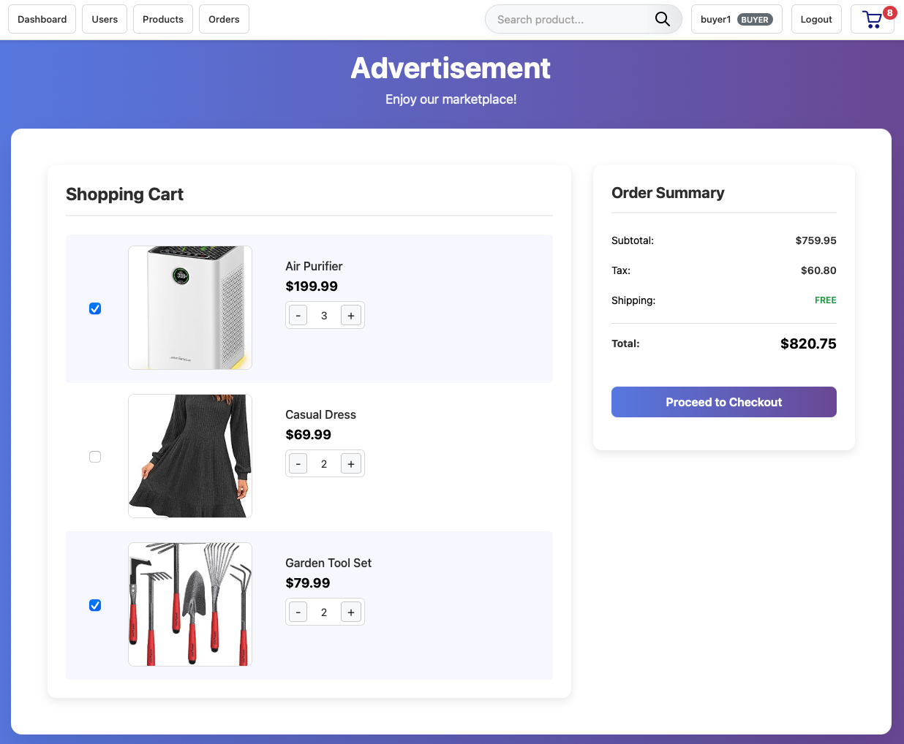

# Marketplace - E-Commerce Platform




## Quick Start

### Prerequisites

- Node.js (v16 or higher)
- npm or yarn

Note: This guide includes MongoDB installation instructions for users who don't have it installed,
It also includes MongoDB database setup.

## Installation

1. Clone the repository

   ```bash
   git clone https://github.com/Joey-Chow/Marketplace.git
   cd marketplace
   ```

2. Install dependencies

   ```bash
   npm install
   ```

3. Install and Configure MongoDB

   Install MongoDB server

   ```bash
   brew tap mongodb/brew
   brew install mongodb-community
   ```

   Start MongoDB

   ```bash
   brew services start mongodb-community
   ```

   **Configure MongoDB Replica Set (Required for ACID Transactions)**

   Connect to MongoDB shell:

   ```bash
   mongosh
   ```

   Initialize replica set:

   ```javascript
   rs.initiate({
     _id: "rs0",
     members: [{ _id: 0, host: "127.0.0.1:27017" }],
   });
   ```

   Exit MongoDB shell:

   ```javascript
   exit;
   ```

4. Set up environment variables

   Create .env file with replica set configuration:

   ```bash
   MONGODB_URI=mongodb://127.0.0.1:27017/marketplace?replicaSet=rs0
   JWT_SECRET=your-super-secure-jwt-secret-key
   PORT=3000
   NODE_ENV=development
   ```

5. Seed the database

   ```bash
   node scripts/seedDatabase.js
   ```

6. Start the server

   ```bash
   npm start
   # or for development with auto-reload
   npm run dev
   ```

7. Access the application
   - Main App: http://localhost:3000
   - Dashboard: http://localhost:3000/dashboard.html

## DEliverable for assignment:
 1, Project Description is in docs/'Project_Description.md'
 2, All task based documentations are in docs/'Report.PDF'

 Note: For our own convenience and future reference, we have sepratedly add the task-based documentations in corresponding file. Specifically:
 all the documentations navigations can be found in docs/'Report.md',

 The description of this project architecture is in docs/'architeure.md'.